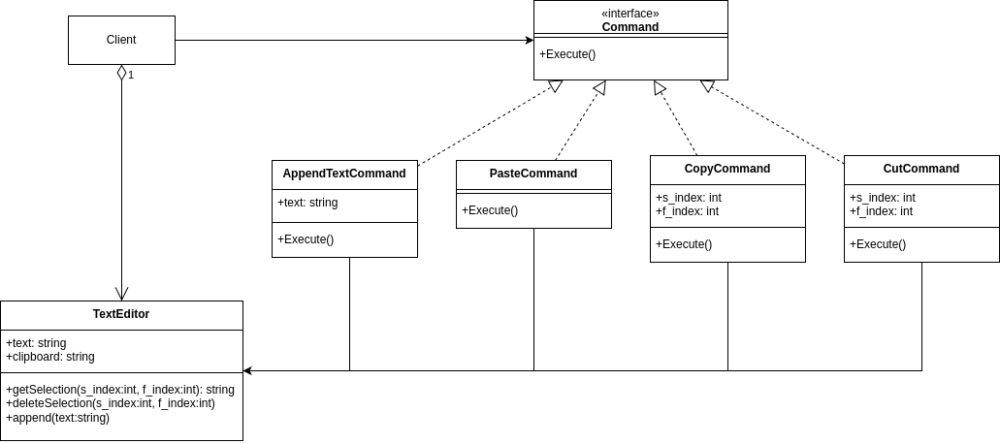

# Behavioral - Command
## Theory
### Intent

Command is a behavioral design pattern that turns a request into a stand-alone object that contains all information about the request. This transformation lets you pass requests as a method arguments, delay or queue a request’s execution, and support undoable operations.

### Applicability

Use the Command pattern when you want to parametrize objects with operations.

Use the Command pattern when you want to queue operations, schedule their execution, or execute them remotely.

Use the Command pattern when you want to implement reversible operations.

Most often it’s used as an alternative for callbacks to parameterizing UI elements with actions. It’s also used for queueing tasks, tracking operations history, etc.

## My practice implementation
### Problem statement

I will make a CLI program that allows the user to select either appending text from console or choosing of 4 different actions: copy (specify indexes), cut (specify indexes), and paste, and append text (specify new text).

### UML diagram



### Implementation [code](Command.cs)

```csharp
public interface ICommand
{
    public void Execute();
}

public abstract class ITwoIndexCommand : ICommand
{
    protected readonly int s_index;
    protected readonly int e_index;
    protected TextEditor _editor; 
    
    public ITwoIndexCommand(TextEditor textEditor, int s_index, int e_index)
    {
        _editor = textEditor;
        this.s_index = s_index;
        this.e_index = e_index;
    }
    
    public abstract void Execute();
}

public class CopyCommand : ITwoIndexCommand
{
    public CopyCommand(TextEditor editor, int s_index, int e_index):base(editor, s_index, e_index)
    {
    }

    public override void Execute()
    {
        _editor.Clipboard = _editor.GetSelection(s_index, e_index);
    }
}

public class CutCommand : ITwoIndexCommand
{
    private readonly int s_index;
    private readonly int e_index;
    private TextEditor _editor; 

    public CutCommand(TextEditor editor, int s_index, int e_index):base(editor, s_index, e_index)
    {
        _editor = editor;
        this.s_index = s_index;
        this.e_index = e_index;
    }

    public override void Execute()
    {
        _editor.Clipboard = _editor.GetSelection(s_index, e_index);
        _editor.DeleteSelection(s_index, e_index);
    }
}

public abstract class IStringCommand : ICommand
{
    protected readonly string text;
    protected TextEditor _editor;

    public IStringCommand(TextEditor editor, string text)
    {
        _editor = editor;
        this.text = text;
    }

    public abstract void Execute();
}

public class AppendTextCommand : IStringCommand
{
    private readonly string _text;
    private TextEditor _editor; 

    public AppendTextCommand(TextEditor editor, string text): base(editor, text)
    {
        _editor = editor;
        _text = text;
    }

    public override void Execute()
    {
        _editor.Append(_text);
    }
}

public class PasteCommand : ICommand
{
    private TextEditor _editor; 

    public PasteCommand(TextEditor editor)
    {
        _editor = editor;
    }

    public void Execute()
    {
        _editor.Append(_editor.Clipboard);
    }
}

public class TextEditor
{
    public string Text { get; set; }
    public string Clipboard { get; set; }

    public TextEditor()
    {
        Text = "012345";
        Clipboard = "";
    }

    public string GetSelection(int s_index, int e_index)
    {
        var length = e_index - s_index;
        return Text.Substring(s_index, length);
    }

    public void DeleteSelection(int s_index, int e_index)
    {
        var count = e_index - s_index;
        Text = Text.Remove(s_index, count);
    }

    public void Append(string text)
    {
        Text = Text + text;
    }
}
```

### Client [code](CommandClient.cs)

```csharp
// TODO: proper error handling
Console.WriteLine(@"Command Client start\n");

// create the TextEditor
var myTextEditor = new TextEditor();

var cli = new CLIController(myTextEditor);

while (true)
{
    Console.WriteLine("");
    Console.WriteLine($"Text: {myTextEditor.Text}");
    Console.WriteLine($"Clipboard: {myTextEditor.Clipboard}");
    cli.Run();
    // reset the CLI choices to default
    cli = new CLIController(myTextEditor);
}
```

There is in fact more code in the [CLI.cs](CLI.cs) file which implements the CLI program in Command + generic design pattern, but it got a bit messy, and it was supposed to implement a bit more, but never mind.