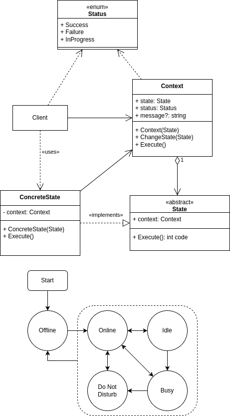

# Behavioral - State
## Theory
### Intent

State is a behavioral design pattern that lets an object alter its behavior when its internal state changes. It appears as if the object changed its class.

### Applicability

Use the State pattern when you have an object that behaves differently depending on its current state, the number of states is enormous, and the state-specific code changes frequently.

Use the pattern when you have a class polluted with massive conditionals that alter how the class behaves according to the current values of the class’s fields.

Use State when you have a lot of duplicate code across similar states and transitions of a condition-based state machine.

## My practice implementation
### Problem statement

The example will demonstrate how the State design pattern can apply to the design of an online presence management system for an application such as a chat app or work monitoring app.

The states would include: Offline, Online, Idle, Busy and Do Not Disturb.

Users are by default in the offline state.
Offline -> Online. If user logs in.
Online -> Idle. If user is idle.
Idle -> Online. If user interacts with the program.
Online <-> Busy. If user is attending a scheduled event.
Do Not Disturb. If user selects that status. (Overrides Busy and Idle status)
Everything -> Offline. User can go offline at any status.

### UML diagram



### Implementation [code](State.cs)

```csharp
public class Context
{
    public Presence Presence;
    public string? Message;

    public Context()
    {
        Presence = new Offline(this);
    }

    public void ChangeState(Presence newPresence)
    {
        Presence = newPresence;
    }

    public void BecomeOnline()
    {
        Presence.BecomeOnline();
    }
    public void BecomeOffline()
    {
        Presence.BecomeOffline();
    }
    public void BecomeIdle()
    {
        Presence.BecomeIdle();
    }
    public void BecomeBusy()
    {
        Presence.BecomeBusy();
    }
    public void ToggleDoNotDisturb()
    {
        Presence.ToggleDoNotDisturb();
    }
}

public abstract class Presence
{
    public Context Context;

    protected Presence(Context context)
    {
        Context = context;
    }

    public void SetContext(Context context)
    {
        Context = context;
    }

    public abstract void BecomeOnline();
    public abstract void BecomeOffline();
    public abstract void BecomeBusy();
    public abstract void BecomeIdle();
    public abstract void ToggleDoNotDisturb();
}
    
public class Offline(Context context) : Presence(context)
{
    public override void BecomeOnline()
    {
        Console.WriteLine("Offline -> Online");
        Context.ChangeState(new Online(Context));
    }
    
    public override void BecomeOffline() {}

    public override void BecomeBusy() { }

    public override void BecomeIdle() { }

    public override void ToggleDoNotDisturb() {}
}

public class Online(Context context) : Presence(context)
{
    public override void BecomeOnline() { }
    
    public override void BecomeOffline()
    {
        Console.WriteLine("Online -> Offline");
        Context.ChangeState(new Offline(Context));
    }
    
    public override void BecomeBusy()
    {
        Console.WriteLine("Online -> Busy");
        Context.ChangeState(new Busy(Context));
    }
    
    public override void BecomeIdle()
    {
        Console.WriteLine("Online -> Idle");
        Context.ChangeState(new Idle(Context));
    }

    public override void ToggleDoNotDisturb()
    {
        Console.WriteLine("Online -> DoNotDisturb");
        Context.ChangeState(new DoNotDisturb(Context));
    }
}

public class Busy(Context context) : Presence(context)
{
    public override void BecomeOnline()
    {
        Console.WriteLine("Busy -> Online");
        Context.ChangeState(new Online(Context));
    }

    public override void BecomeOffline()
    {
        Console.WriteLine("Busy -> Offline");
        Context.ChangeState(new Offline(Context));
    }
    
    public override void BecomeBusy() { }

    public override void BecomeIdle() { }

    public override void ToggleDoNotDisturb()
    {
        Console.WriteLine("Busy -> DoNotDisturb");
        Context.ChangeState(new DoNotDisturb(Context));
    }
}

public class Idle(Context context) : Presence(context)
{
    public override void BecomeOnline()
    {
        Console.WriteLine("Idle -> Online");
        Context.ChangeState(new Online(Context));
    }

    public override void BecomeOffline()
    {
        Console.WriteLine("Idle -> Offline");
        Context.ChangeState(new Offline(Context));
    }

    public override void BecomeBusy()
    {
        Console.WriteLine("Idle -> Busy");
        Context.ChangeState(new Busy(Context));
    }

    public override void BecomeIdle() { }

    public override void ToggleDoNotDisturb() { }
}

public class DoNotDisturb(Context context) : Presence(context)
{
    public override void BecomeOnline()
    {
        Console.WriteLine("DoNotDisturb -> Online");
        Context.ChangeState(new Online(Context));
    }

    public override void BecomeOffline()
    {
        Console.WriteLine("DoNotDisturb -> Offline");
        Context.ChangeState(new Offline(Context));
    }
    
    public override void BecomeBusy() { }

    public override void BecomeIdle() { }

    public override void ToggleDoNotDisturb()
    {
        Console.WriteLine("DoNotDisturb -> Online");
        Context.ChangeState(new Online(Context));
    }
}
```

### Client [code](StateClient.cs)

```csharp
var context = new Context();

// Get online
context.BecomeOnline();

// Become idle
context.BecomeIdle();

// Scheduled event occurs thus become busy
context.BecomeBusy();

// Turn on DoNotDisturb status
context.ToggleDoNotDisturb();

// Go offline
context.BecomeOffline();

// expected output:
// Offline -> Online
// Online -> Idle
// Idle -> Busy
// Busy -> DoNotDisturb
// DoNotDisturb -> Offline
```