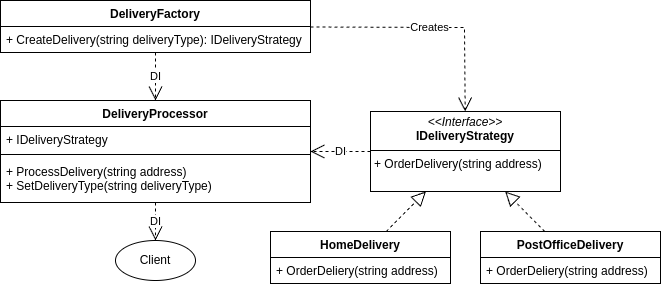

# Creational - Strategy
## Theory
### Intent

Strategy is a behavioral design pattern that lets you define a family of algorithms, put each of them into a separate class, and make their objects interchangeable.

### Applicability

Use the Strategy pattern when you want to use different variants of an algorithm within an object and be able to switch from one algorithm to another during runtime.

Use the Strategy when you have a lot of similar classes that only differ in the way they execute some behavior.

Use the pattern to isolate the business logic of a class from the implementation details of algorithms that may not be as important in the context of that logic.

Use the pattern when your class has a massive conditional statement that switches between different variants of the same algorithm.

## My practice implementation
### Problem statement

In an ecommerce shop, there are different methods of delivering the goods to the customer. Different delivery options include different couriers (PostNord, Bring, etc.), home delivery or picking it up at a post office, and picking it up at the physical store.

The Strategy pattern can be utilized here to represent the different strategies. I will be implementing it using DI, since each Strategy might require its own injected services.

### UML Diagram



### Implementation [code](Strategy.cs)

```csharp
public interface IDeliveryStrategy
{
    void OrderDelivery(string address);
}

public class HomeDelivery: IDeliveryStrategy
{
    // private readonly ILogger<IDeliveryStrategy> _logger;
    
    public HomeDelivery()
    {
        // various DI services
    }

    public void OrderDelivery(string address)
    {
        Console.WriteLine($"Home delivering to {address}!");
    }
}

public class PostOfficeDelivery: IDeliveryStrategy
{
    public PostOfficeDelivery()
    {
        // various DI services
    }
    
    public void OrderDelivery(string address)
    {
        Console.WriteLine($"Post Office delivering to {address}!");
    }
}

public class DeliveryProcessor
{
    private readonly DeliveryFactory _deliveryFactory;

    public DeliveryProcessor(DeliveryFactory deliveryFactory)
    {
        _deliveryFactory = deliveryFactory;
    }

    public void ProcessDelivery(string deliveryType, string address)
    {
        var deliveryStrategy = _deliveryFactory.CreateDeliveryStrategy(deliveryType);
        deliveryStrategy.OrderDelivery(address);
    }
}
    
public class DeliveryFactory
{
    private readonly IServiceProvider _serviceProvider;

    public DeliveryFactory(IServiceProvider serviceProvider)
    {
        _serviceProvider = serviceProvider;
    }

    public IDeliveryStrategy CreateDeliveryStrategy(string deliveryType)
    {
        return deliveryType switch
        {
            "HomeDelivery" => _serviceProvider.GetRequiredService<HomeDelivery>(),
            "PostOfficeDelivery" => _serviceProvider.GetRequiredService<PostOfficeDelivery>(),
            _ => throw new ArgumentException("Invalid delivery type")
        };
    }
}
```

### Client [code](StrategyClient.cs)

```csharp
Console.WriteLine(@"Strategy Client start\n");

// use ServiceCollection to use DI
var services = new ServiceCollection();

// strategy
services.AddScoped<PostOfficeDelivery>();
services.AddScoped<HomeDelivery>();

// strategy factory. Converts string deliveryType to IDeliveryStrategy DI service.
services.AddScoped<DeliveryFactory>();

// processor that executes the delivery strategy
services.AddScoped<DeliveryProcessor>();

var serviceProvider = services.BuildServiceProvider();

// 1. imagine this is the start of a request that makes a home delivery

var deliveryProcessor = serviceProvider.GetRequiredService<DeliveryProcessor>();

var request1_deliveryType = "HomeDelivery";
var request1_address = "1 Apple Street";

deliveryProcessor.ProcessDelivery(request1_deliveryType, request1_address);

// 2. second request

var request2_deliveryType = "PostOfficeDelivery";
var request2_address = "2 Apple Street";

deliveryProcessor.ProcessDelivery(request2_deliveryType, request2_address);
```