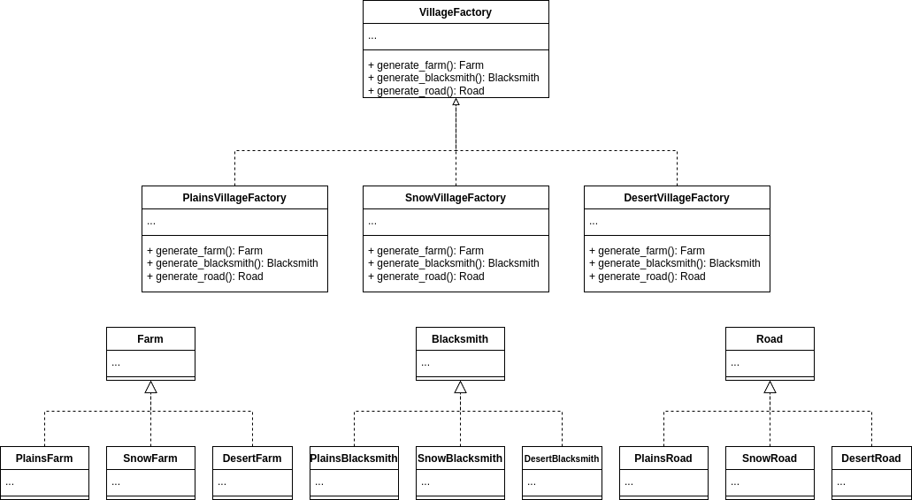

# Creational - Abstract Factory
## Theory
### Intent

Provides an interface to produce families of related objects without specifying their concrete classes.

### Applicability

Use the Abstract Factory when your code needs to work with various families of related products, but you don’t want it to depend on the concrete classes of those products—they might be unknown beforehand or you simply want to allow for future extensibility.

Consider implementing the Abstract Factory when you have a class with a set of Factory Methods that blur its primary responsibility.

## My practice implementation
### Problem statement

Taking inspiration from Minecraft, villages are a collection of procedurally generated buildings/structures and their appearances are modified depending on factors such as the biome they are located. 

The Abstract Factory pattern can apply to village structure generation as the appearance of the buildings in the same village make up a family of related buildings by biome appearance, which are distinct from other families.

Therefore, a VillageFactory interface can be implemented as a ConcreteVillageFactory that only generates buildings that are related to this specific ConcreteVillageFactory's biome. This could for example be PlainsVillageFactory or SnowVillageFactory.

### UML diagram



### Implementation [code](AbstractFactory.cs)

```csharp
public interface VillageFactory
{
    public Farm GenerateFarm();
    public Blacksmith GenerateBlacksmith();
    public Road GenerateRoad();
}

public class PlainsVillageFactory : VillageFactory
{
    public Farm GenerateFarm()
    {
        return new PlainsFarm();
    }
    public Blacksmith GenerateBlacksmith()
    {
        return new PlainsBlacksmith();
    }
    public Road GenerateRoad()
    {
        return new PlainsRoad();
    }
}

public class SnowVillageFactory : VillageFactory
{
    public Farm GenerateFarm()
    {
        return new SnowFarm();
    }
    public Blacksmith GenerateBlacksmith()
    {
        return new SnowBlacksmith();
    }
    public Road GenerateRoad()
    {
        return new SnowRoad();
    }
}

public class DesertVillageFactory : VillageFactory
{
    public Farm GenerateFarm()
    {
        return new DesertFarm();
    }
    public Blacksmith GenerateBlacksmith()
    {
        return new DesertBlacksmith();
    }
    public Road GenerateRoad()
    {
        return new DesertRoad();
    }
}

public abstract class Structure
{
    public string Type { get; set; }
    public string Biome { get; set; }
}

public class Farm : Structure
{
    protected Farm()
    {
        Type = "Farm";
    }
}

public class PlainsFarm : Farm
{
    public PlainsFarm() : base()
    {
        Biome = "Plains";
    }
}

public class SnowFarm : Farm
{
    public SnowFarm() : base()
    {
        Biome = "Snow";
    }
}

public class DesertFarm : Farm
{
    public DesertFarm() : base()
    {
        Biome = "Desert";
    }
}


public class Blacksmith : Structure
{
    protected Blacksmith()
    {
        Type = "Blacksmith";
    }
}

public class PlainsBlacksmith : Blacksmith
{
    public PlainsBlacksmith() : base()
    {
        Biome = "Plains";
    }
}

public class SnowBlacksmith : Blacksmith
{
    public SnowBlacksmith() : base()
    {
        Biome = "Snow";
    }
}

public class DesertBlacksmith : Blacksmith
{
    public DesertBlacksmith() : base()
    {
        Biome = "Desert";
    }
}


public class Road : Structure
{
    protected Road()
    {
        Type = "Road";
    }
}

public class PlainsRoad : Road
{
    public PlainsRoad() : base()
    {
        Biome = "Plains";
    }
}

public class SnowRoad : Road
{
    public SnowRoad() : base()
    {
        Biome = "Snow";
    }
}

public class DesertRoad : Road
{
    public DesertRoad() : base()
    {
        Biome = "Desert";
    }
}
```

### Client [code](AbstractFactoryClient.cs)

```csharp
Console.WriteLine("Abstract Factory Client start");

// Depending on which biome the village generation is taking place, determines what style of village is generated.
// Plains biome results in villages with plains architecture, and so forth for snow biome and desert biome.

VillageFactory villageFactory;

// Let's use rng to determine which biome is being used.
var rand = new Random();
var roll = rand.Next(0, 3); // 0 = plains, 1 = snow, 2 = desert
switch (roll)
{
    case 0:
        villageFactory = new PlainsVillageFactory();
        break;
    case 1:
        villageFactory = new SnowVillageFactory();
        break;
    default:
        villageFactory = new DesertVillageFactory();
        break;
}

// Let's generate 1 of each structure.
var farm = villageFactory.GenerateFarm();
var blacksmith = villageFactory.GenerateBlacksmith();
var road = villageFactory.GenerateRoad();

// Check if they are all the biome.
Console.WriteLine("<Object>: <Type> <Biome>");
Console.WriteLine($"Farm: {farm.Type}, {farm.Biome}");
Console.WriteLine($"Blacksmith: {blacksmith.Type}, {blacksmith.Biome}");
Console.WriteLine($"Road: {road.Type}, {road.Biome}");
```