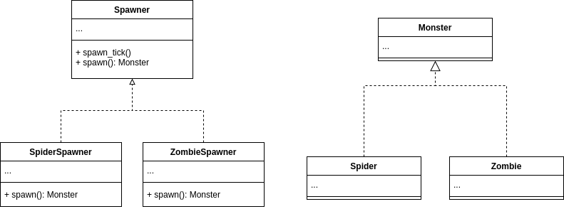

# Creational - Factory Method
## Theory
### Intent

Provides an interface for creating objects in a superclass, but allows subclasses to alter the type of objects that will be created.

### Applicability

Use the Factory Method when you don't know beforehand the exact types and dependencies of the objects your code should work with.

Use the Factory Method when you want to provide users of your library or framework with a way to extend its internal components.

Use the Factory Method when you want to save system resources by reusing existing objects instead of rebuilding them each time.

## My practice implementation
### Problem statement

Taking inspiration from Minecraft, a monster spawner is a block that spawns monsters. The spawner can only spawn one type of monster at a time and can't change to spawn a different type of monster.

The Factory Method pattern is suitable for this problem, as it is a simple case of deferring the concrete implementation to subclasses.

### UML diagram



### Implementation [code](FactoryMethod.cs)

```csharp
public abstract class MonsterSpawner
{
    protected abstract Monster CreateMonster();

    public void spawn_tick()
    {
        var monster = CreateMonster();
        /* perform business logic to configure monster health and attack power */
        Console.WriteLine($"Spawned monster: {monster.Name}");
    }
}

public class SpiderSpawner : MonsterSpawner
{
    protected override Monster CreateMonster()
    {
        return new Spider();
    }
}

public class ZombieSpawner : MonsterSpawner
{
    protected override Monster CreateMonster()
    {
        return new Zombie();
    }
}

public abstract class Monster
{
    public string Name { get; set; }
    
    public void attack()
    {
        /* attack implementation */
    }
}

public class Spider : Monster
{
    public Spider()
    {
        base.Name = "Spider";
    }
}

public class Zombie : Monster
{
    public Zombie()
    {
        base.Name = "Zombie";
    }
}
```

### Client [code](FactoryMethodClient.cs)

```csharp
Console.WriteLine("Factory Method Client start");

// let's create a monster spawner with a 50/50 chance of being either for Spider or Zombie
MonsterSpawner spawner;

var rand = new Random();
var roll = rand.Next(0, 2);
if (roll == 0)
{
    spawner = new SpiderSpawner();
}
else
{
    spawner = new ZombieSpawner();
}

// test out spawner tick
spawner.spawn_tick();
```