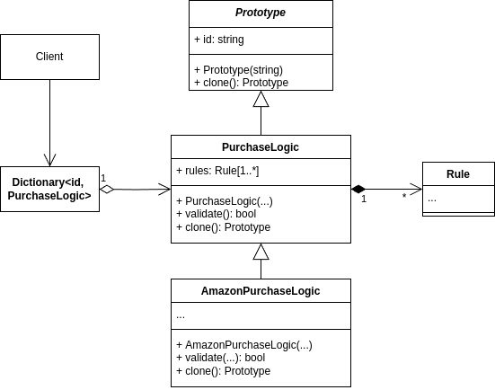

# Creational - Prototype
## Theory
### Intent

Prototype is a creational design pattern that lets you copy existing objects without making your code dependent on their classes.

### Applicability

Use the Prototype pattern when your code shouldn’t depend on the concrete classes of objects that you need to copy.

Use the pattern when you want to reduce the number of subclasses that only differ in the way they initialize their respective objects.

Use the Prototype pattern when the cost of constructing objects from scratch is computationally expensive, and it is easier to just clone from a repository of those objects.

## My practice implementation
### Problem statement

This is basically just making a class duplicable, like deep copy in Rust's Clone attribute.
I will be using `(Class)this.MemberwiseClone()`.

The implementation will demonstrate how the PurchaseLogic class is clonable, how the more concrete AmazonPurchaseLogic subclass is also clonable and how a registry can be used to store the PurchaseLogic objects so they can be used for their subsequent cloning and use. 

### UML diagram



### Implementation [code](Prototype.cs)

```csharp
public abstract class Prototype {
    public readonly string id;

    public Prototype(string id) {
        this.id = id;
    }

    public abstract Prototype Clone();
}

public class Rule : Prototype {
    // rule logic implementation

    public string logic { get; set; }

    public Rule(string id, string logic):base(id) {
        this.logic = logic;
    }

    public override Rule Clone() {
        return (Rule) this.MemberwiseClone();
    }
}

public class PurchaseLogic : Prototype {
    public List<Rule> rules;

    public PurchaseLogic(string id, List<Rule> rules):base(id) {
        this.rules = rules;
        if (!validate()) { // validate is computationally expensive
            throw new Exception("Invalid PurchaseLogic rules.");
        }
    }

    public bool validate() {
        // imagine that this is a computationally expensive operation.
        return true;
    }

    public override PurchaseLogic Clone() {
        PurchaseLogic clone = (PurchaseLogic) this.MemberwiseClone();
        clone.rules = rules.Select(rule => (Rule)rule.Clone()).ToList();
        return clone;
    }
}

public class AmazonPurchaseLogic : PurchaseLogic {
    private String? specific_amazon_config;

    public AmazonPurchaseLogic(string id, List<Rule> rules):base(id, rules) {
    }

    public override AmazonPurchaseLogic Clone() {
        AmazonPurchaseLogic clone = (AmazonPurchaseLogic) this.MemberwiseClone();
        clone.rules = rules.Select(rule => (Rule)rule.Clone()).ToList();
        return clone;
    }
}
```

### Client [code](PrototypeClient.cs)

```csharp
Console.WriteLine(@"Prototype Client start\n");

// First: demonstrate cloning (deep copy) on the PurchaseLogic class
Console.WriteLine("First: demonstrate cloning (deep copy) on the PurchaseLogic class");
List<Rule> firstRules = new List<Rule> { new(id:"rule1", logic:"VeryLogical") };
var firstPL = new PurchaseLogic("first", firstRules);
var clonedFirstPL = firstPL.Clone();

// if we change firstPL's rule1, it will not change the clonedFirstPL's rule1
firstPL.rules[0].logic = "NotLogical";
Console.WriteLine($"firstPL rule1's logic: {firstPL.rules[0].logic}");
Console.WriteLine($"clonedFirstPL rule1's logic: {clonedFirstPL.rules[0].logic}");

// expected print outcome:
// firstPL rule1's logic: NotLogical
// clonedFirstPL rule1's logic: VeryLogical

Console.WriteLine();

// Second: demonstrate cloning (deep copy) on the AmazonPurchaseLogic subclass
Console.WriteLine("Second: demonstrate cloning (deep copy) on the AmazonPurchaseLogic subclass");
List<Rule> secondRules = new List<Rule> { new(id:"rule2", logic:"VeryLogical") };
var amazonPL = new AmazonPurchaseLogic("second", secondRules);
var clonedAmazonPL = amazonPL.Clone();

// if we change amazonPL's rule2, it will not change the clonedAmazonPL's rule1
amazonPL.rules[0].logic = "NotLogical";
Console.WriteLine($"amazonPL rule2's logic: {amazonPL.rules[0].logic}");
Console.WriteLine($"clonedAmazonPL rule2's logic: {clonedAmazonPL.rules[0].logic}");

// expected print outcomes:
// amazonPL rule2's logic: NotLogical
// clonedAmazonPL rule2's logic: VeryLogical

Console.WriteLine();

// Third: demonstate the use of a Dictionary<TKey, TValue> to store Prototypes
// and simply clone them instead of constructing them from scratch (which may be computationally expensive)
Console.WriteLine("Third: use a repository to store PurchaseLogic so we avoid the computationally expensive process of constructing them from scratch");
var repository = new Dictionary<string, PurchaseLogic>();
repository.Add(firstPL.id, firstPL);
repository.Add(amazonPL.id , amazonPL);

// make a clone of firstPL from the repository
var thirdPL = repository["first"].Clone();

// change thirdPL
thirdPL.rules[0].logic = "NullString";
Console.WriteLine($"repository firstPL rule1's logic: {repository["first"].rules[0].logic}");
Console.WriteLine($"thirdPL rule1's logic: {thirdPL.rules[0].logic}");

// expected prinbt outcome:
// repository firstPL rule1's logic: NotLogical
// thirdPL rule1's logic: NullString
```