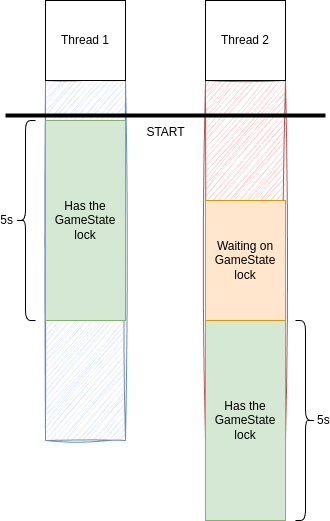

# Creational - Singleton
## Theory
### Intent

Singleton is a creational design pattern that lets you ensure that a class has only one instance, while providing a global access point to this instance.

### Applicability

Use the Singleton pattern when a class in your program should have just a single instance available to all clients; for example, a single database object shared by different parts of the program.

Use the Singleton pattern when you need stricter control over global variables.

## My practice implementation
### Problem statement

In this hypothetical video game, there are different threads that need to modify and read the same global resource (let's say in-memory game state). To avoid race conditions and prevent the game from becoming indeterministic, the reading and writing of the global resource needs to be made thread-safe.

Using the Singleton pattern can help solve this by making sure that only one thread at a time can read or write to the global resource. 

The Microsoft.Extensions.DependencyInjection package will be used to add DI to the project.

### Thread lock diagram



### Implementation [code](Singleton.cs)

```csharp
public class SingletonGameState
{
    private Dictionary<string, string> _gameState;
    private readonly object _lock = new();
    
    public SingletonGameState()
    {
        // _gameState = new Dictionary<string, string>();
        _gameState = new Dictionary<string, string> {{"1", "one"}, {"2", "two"}};
    }

    public string?[] ReadGameStates(string[] gameStateKeys)
    {
        var output = new string?[gameStateKeys.Length];
        lock (_lock)
        {
            Console.WriteLine($"[{Thread.CurrentThread.ManagedThreadId}] has the lock!");
            Thread.Sleep(5000);
            for(int i = 0; i < gameStateKeys.Length; i++)
            {
                output[i] = _gameState.GetValueOrDefault(gameStateKeys[i]);
            }
        }
        
        Console.WriteLine($"[{Thread.CurrentThread.ManagedThreadId}] dropped the lock!");

        return output;
    }

    public void WriteGameStates(string[] gameStateKeys, string[] gameStateValues)
    {
        if (gameStateKeys.Length != gameStateValues.Length) throw new ArgumentException("gameStateKeys and gameStateValues count do not match");
        
        lock (_lock)
        {
            for (int i = 0; i < gameStateKeys.Length; i++)
            {
                _gameState[gameStateKeys[i]] = gameStateValues[i];
            }
        }
    }
}
```

### Client [code](SingletonClient.cs)

```csharp
Console.WriteLine(@"Singleton Client start\n");

// use ServiceCollection to use DI to create Singleton
var services = new ServiceCollection();

services.AddSingleton<SingletonGameState>(); // this makes it a singleton

// get serviceProvider and resolve the Singleton service

var serviceProvider = services.BuildServiceProvider();

var gameStateService = serviceProvider.GetRequiredService<SingletonGameState>();

// Test 1: Simple read: read the default values initialized in the Singleton constructor

var input1 = new [] {"1", "2"};
var output1 = gameStateService.ReadGameStates(input1);

Console.WriteLine("Test 1: Simple read");
foreach (var value in input1.Zip(output1, Tuple.Create))
{
    Console.WriteLine(value.Item1 + ": " + value.Item2);
}

// Test 2: Simple write then read

var input2_keys = new[] { "1", "3" };
var input2_values = new[] { "ONE-ONE", "THREE" };

gameStateService.WriteGameStates(input2_keys, input2_values);

var input2_readAll = new[] { "1", "2", "3" };
var output2_readAll = gameStateService.ReadGameStates(input2_readAll);
Console.WriteLine("Test 2: Simple write then read");
foreach (var value in input2_readAll.Zip(output2_readAll, Tuple.Create))
{
    Console.WriteLine(value.Item1 + ": " + value.Item2);
}

// Test 3: Thread lock test read
Thread thread1 = new(() =>
{
    Console.WriteLine($"[{Thread.CurrentThread.ManagedThreadId}] Thread 1 starting...");
    gameStateService.ReadGameStates(input2_readAll);
    Console.WriteLine($"[{Thread.CurrentThread.ManagedThreadId}] Thread 1 finished!");
});

Thread thread2 = new(() =>
{
    Console.WriteLine($"[{Thread.CurrentThread.ManagedThreadId}] Thread 2 starting...");
    Thread.Sleep(2000);
    Console.WriteLine(
        $"[{Thread.CurrentThread.ManagedThreadId}] Thread 2 waited 2 seconds. Try to get lock...");
    gameStateService.ReadGameStates(input2_readAll);
    Console.WriteLine($"[{Thread.CurrentThread.ManagedThreadId}] Thread 2 finished!");
});

thread1.Start();
thread2.Start();

thread1.Join();
thread2.Join();

Console.WriteLine("All threads completed.");
```