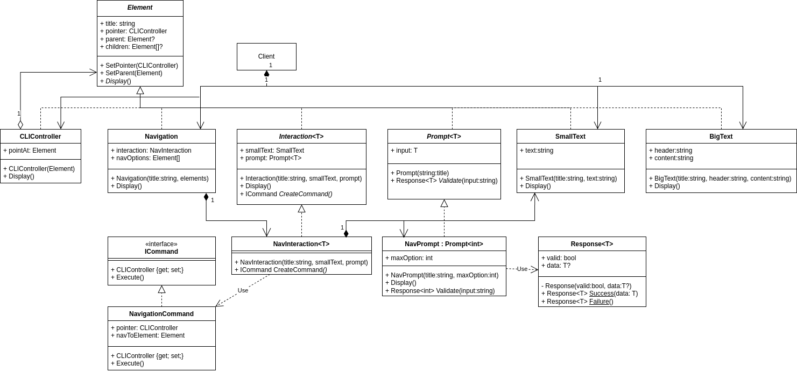

# Structural - Composite
## Theory
### Intent

Composite is a structural design pattern that lets you compose objects into tree structures and then work with these structures as if they were individual objects.

### Applicability

Use the Composite pattern when you have to implement a tree-like object structure.

Use the pattern when you want the client code to treat both simple and complex elements uniformly.

## My practice implementation
### Problem statement

I will implement a CLI program that allows a user to navigate the options. Some options just display some text, other options act as a directory, containing more options inside itself.

This directory structure is built using a composite tree structure.

### UML diagram



### Implementation [code](Composite.cs)

```csharp
public abstract class Element
{
    public string Title { get; set; }
    public CLIController Pointer { get; set; }
    public Element? Parent { get; set; }
    public List<Element>? Children { get; set; }
    public void SetPointer(CLIController root)
    {
        Pointer = root;
        if (Children != null)
        {
            foreach (var element in Children)
            {
                element.SetPointer(root);
            }
        }
    }

    public void SetParent(Element parent)
    {
        Parent = parent;
        if (Children != null)
        {
            foreach (var element in Children)
            {
                element.SetParent(this);
            }
        }
    }
    
    public abstract void Display();
}

public class CLIController : Element
{
    public Element PointAt { get; set; }
    public CLIController(Element pointAt)
    {
        this.SetPointer(this);
        pointAt.SetPointer(this);
        pointAt.SetParent(this);
        PointAt = pointAt;
    }

    public override void Display()
    {
        PointAt.Display();
    }
}

// leads to individual elements or other navigations
public class Navigation : Element
{
    public NavInteraction Interaction { get; set; }
    public Element[] NavOptions { get; set; }
    public Navigation(string title, Element[] elements)
    {
        Title = title;
        NavOptions = elements;
        Children = elements.ToList();
        Interaction = new NavInteraction(
            title: "NavigationInteraction", 
            new SmallText(title: "", text: "Enter a navigation option: "), 
            new NavPrompt(title:"", maxOption: NavOptions.Length)
        );
        Children.Add(Interaction);
    }

    public override void Display()
    {
        var counter = 1;
        foreach (var element in NavOptions)
        {
            Console.WriteLine($"{counter}. {element.Title}");
            counter++;
        }
        Interaction.Display();
    }
}

public abstract class Interaction<T> : Element
{
    public SmallText SmallText { get; set; }
    public Prompt<T> Prompt { get; set; }

    public Interaction(string title, SmallText smallText, Prompt<T> prompt)
    {
        Title = title;
        SmallText = smallText;
        Prompt = prompt;
    } 

    public override void Display()
    {
        SmallText.Display();
        Prompt.Display();
        var command = CreateCommand();
        command.Execute();
    }

    protected abstract ICommand CreateCommand();
}

public class NavInteraction : Interaction<int>
{
    public NavInteraction(string title, SmallText smallText, Prompt<int> prompt) : base(title, smallText, prompt)
    {
        
    }

    protected override ICommand CreateCommand()
    {
        // create the concrete command
        Element navToElement = Parent.Children[Prompt.Input];
        
        var command = new NavigationCommand(Pointer, navToElement);
        return command;
    }
}

public abstract class Prompt<TOutput> : Element
{
    public TOutput Input { get; set; }

    public Prompt(string title)
    {
        Title = title;
    }

    // public override void Display()
    // {
    //     Input = Console.ReadLine();
    // }

    public abstract ValidationResponse<TOutput> Validate(string input);
}

public class NavPrompt : Prompt<int>
{
    private int _maxOption;
    public NavPrompt(string title, int maxOption) : base(title)
    {
        _maxOption = maxOption;
    }

    public override void Display()
    {
        while (true)
        {
            var input = Console.ReadLine();
            var validation = Validate(input);
            if (validation.Valid)
            {
                this.Input = validation.Data;
                break;
            }
            else
            {
                Console.WriteLine("Invalid input");
            }
        }
    }
    
    public override ValidationResponse<int> Validate(string? input)
    {
        if (input is null || input.Length == 0)
        {
            return ValidationResponse<int>.Failure();
        }

        int parsed;
        try
        {
            parsed = int.Parse(input);
        }
        catch (Exception e)
        {
            return ValidationResponse<int>.Failure();
        }

        // convert to array addresses
        parsed = parsed - 1;
        
        // check array bounds here
        if (parsed < 0 || parsed >= _maxOption)
        {
            return ValidationResponse<int>.Failure();
        }

        return ValidationResponse<int>.Success(parsed);
    }
}

public readonly struct ValidationResponse<T>
{
    public bool Valid { get; }
    public T? Data { get; }

    private ValidationResponse(bool valid, T? data)
    {
        Valid = valid;
        Data = data;
    }

    public static ValidationResponse<T> Success(T data)
    {
        if (data == null)
        {
            throw new ArgumentNullException(nameof(data), "Data cannot be null if success.");
        }

        return new ValidationResponse<T>(true, data);
    }

    public static ValidationResponse<T> Failure()
    {
        return new ValidationResponse<T>(false, default);
    }
}

public class SmallText : Element
{
    public string Text { get; set; }

    public SmallText(string title, string text)
    {
        Title = title;
        Text = text;
    }

    public override void Display()
    {
        Console.WriteLine(Text);
    }
}

public class BigText : Element
{
    public string Header { get; set; }
    public string Content { get; set; }

    public BigText(string title, string header, string content)
    {
        Title = title;
        Header = header;
        Content = content;
    }

    public override void Display()
    {
        Console.WriteLine(Header);
        Console.WriteLine(Content);
    }
}
```

### Client [code](CompositeClient.cs)

```csharp
Console.WriteLine(@"Composite Client start\n");

var root = new Navigation(
    title: "root node",
    elements:
    [
        new SmallText(title: "SmallText", text: "first small text"),
        new BigText(title: "BigText", header: "BigTextHeader", content: "second big text content"),
        new Navigation(
            title: "MyDirectory", elements:
            [
                new SmallText(title: "Another SmallText", text: "first small text again"),
                new BigText(title: "My Big Story", header: "My Big Story",
                    content: "And then the world was saved and lived happily ever after.")
            ]
        )
    ]
);

var cliController = new CLIController(root);

while (true)
{
    cliController.Display();
    //Thread.Sleep(1000);

    // reset cliController if we ended on a leaf node
    if (cliController.PointAt.Children == null)
    {
        cliController.Display();
        cliController.PointAt = root;
        Console.WriteLine("");
    }
}
```