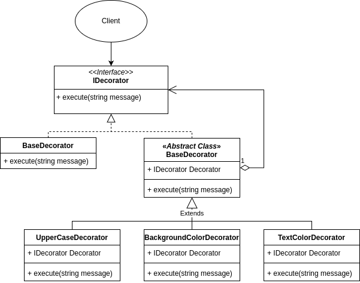
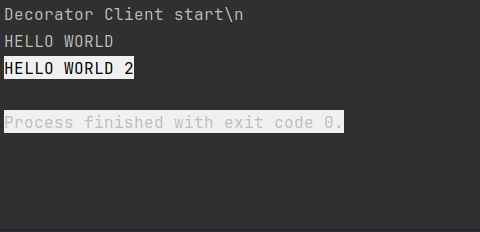

# Behavioral - Decorator aka a Wrapper
## Theory
### Intent

Decorator is a structural design pattern that lets you attach new behaviors to objects by placing these objects inside special wrapper objects that contain the behaviors.

### Applicability

Use the Decorator pattern when you need to be able to assign extra behaviors to objects at runtime without breaking the code that uses these objects.

Use the pattern when it’s awkward or not possible to extend an object’s behavior using inheritance.

## My practice implementation
### Problem Statement

Text formatting system that prints to Console, with text properties such as Background Color, Text Color, Uppercase, Lowercase. 

If an inheritance approach was taken to showing all of those different properties, we would have way too many combinations. Instead by using the Decorator pattern, we can assign each character a text wrapper for each property.

### UML diagram



### Implementation [code](Decorator.cs)

```csharp
namespace DesignPatterns.Structural.Decorator;

public interface IDecorator
{
    public void Execute(string message);
}

// the base of the stack of decorators
public class BaseDecorator : IDecorator
{
    public void Execute(string message)
    {
        Console.WriteLine(message);
    }
}

public abstract class ConcreteDecorator: IDecorator {
    protected readonly IDecorator Decorator;

    public ConcreteDecorator(IDecorator decorator)
    {
        Decorator = decorator;
    }

    public abstract void Execute(string message);
}

public class UpperCaseDecorator : ConcreteDecorator
{
    public UpperCaseDecorator(IDecorator decorator) : base(decorator)
    {
        
    }

    public override void Execute(string message)
    {
        message = message.ToUpper();
        base.Decorator.Execute(message);
    }
}

public class BackgroundColorDecorator : ConcreteDecorator
{
    private readonly ConsoleColor _color;
    public BackgroundColorDecorator(IDecorator decorator, ConsoleColor color) : base(decorator)
    {
        _color = color;
    }

    public override void Execute(string message)
    {
        Console.BackgroundColor = _color;
        base.Decorator.Execute(message);
    }
}

public class TextColorDecorator : ConcreteDecorator
{
    private readonly ConsoleColor _color;
    public TextColorDecorator(IDecorator decorator, ConsoleColor color) : base(decorator)
    {
        _color = color;
    }

    public override void Execute(string message)
    {
        Console.ForegroundColor = _color;
        base.Decorator.Execute(message);
    }
}

```

### Client [code](DecoratorClient.cs)

```csharp
Console.WriteLine(@"Decorator Client start\n");

IDecorator decorator = new BaseDecorator();
decorator = new UpperCaseDecorator(decorator);

decorator.Execute("Hello World");

decorator = new BackgroundColorDecorator(decorator, ConsoleColor.White);
decorator = new TextColorDecorator(decorator, ConsoleColor.Black);

decorator.Execute("Hello World 2");
```

### Result

